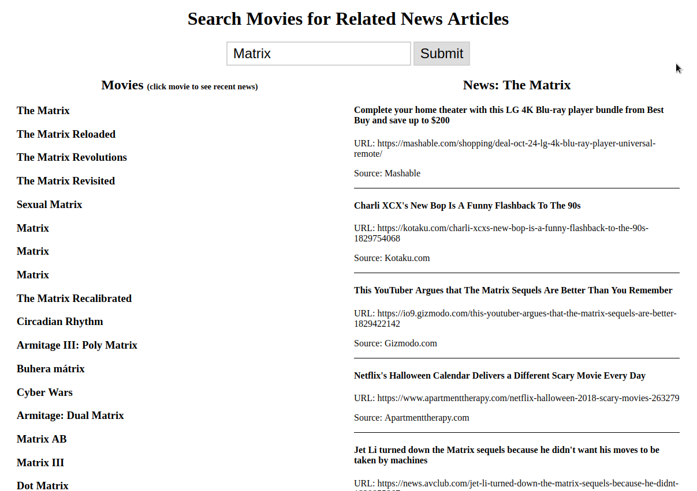

# Movie News Complex API
User inputs a movie title, an API returned an array of movies with that keyword, then made each movie click-able to show any current news about that movie.

**Link to project:** https://eager-northcutt-e064cd.netlify.com

## How It's Made:

**Tech used:** HTML5, CSS3, JavaScript, themoviedb.org's API & newsapi.org's API.
Styling for this project was done using CSS Grid & Flexbox. Written in vanilla Javascript using the fetch method to access API. Retrieved movie keyword from user, which returned all movies with the keyword in their title, then used the movie title from themoviedb.org's API to call news articles with that keyword with newsapi.org's API.

## Lessons Learned:
Learned to come up with different ways of using an API's property to call another API and access its property.

## Examples:

**Weather API** https://github.com/ericamendez/weather-api-bootcamp2018c-week07

**Simple NASA API** https://github.com/ericamendez/simple-nasa-api-bootcamp2018c-week07

**Complex NASA Weather API** https://github.com/ericamendez/complex-nasa-bootcamp2018c-week07
